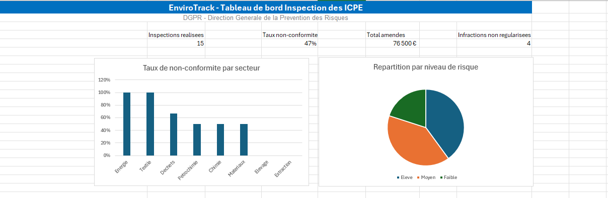

# EnviroTrack — Plateforme de pilotage de l'inspection des ICPE

Projet realise dans le cadre d'une candidature au poste de
charge de mission data en alternance a la DGPR
(Direction Generale de la Prevention des Risques) du
Ministere de la Transition Ecologique.

---

## Contexte

Le bureau de l'inspection des installations classees (BIIC)
de la DGPR pilote l'inspection des ICPE sur l'ensemble du
territoire francais. EnviroTrack simule exactement cet
environnement : consolidation des donnees d'inspection,
analyse des non-conformites, suivi des infractions et
generation automatique de rapports mensuels PDF.

## Apercu du dashboard



---

## Fonctionnalites

| Module | Description |
|---|---|
| Excel + Power Query | Consolidation de 4 sources de donnees en une table d'analyse |
| SQL | Base de donnees relationnelle avec 5 requetes d'analyse metier |
| Python | Generation automatique de rapports PDF mensuels |
| Dashboard Excel | Tableau de bord interactif avec KPIs, histogrammes et camembert |
| Catalogue | Documentation metier de 13 colonnes en CSV et JSON |
---

## Structure du projet

EnviroTrack/
├── data/          → Dataset ICPE (Excel + Power Query)
├── sql/           → Scripts SQL de creation et d'analyse
├── python/        → Generation automatique rapport PDF
├── reports/       → Rapports PDF generes
├── catalog/       → Catalogue de donnees CSV et JSON
└── docs/          → Documentation et captures

---

## Stack technique

- Excel + Power Query — Consolidation et nettoyage des donnees
- SQL (MySQL) — Base de donnees relationnelle et requetes metier
- Python — Generation automatique de rapports PDF (reportlab)
- Git / GitHub — Versioning professionnel

---

## Lancer le projet

### 1. Cloner le repo
```bash
git clone https://github.com/LegreArnold/EnviroTrack.git
cd EnviroTrack
```

### 2. Creer l'environnement virtuel
```bash
python -m venv venv
venv\Scripts\activate
pip install -r requirements.txt
```

### 3. Lancer les modules
```bash
# Generer le catalogue de donnees
python catalog/catalogue.py

# Generer le rapport PDF mensuel
python python/rapport_pdf.py
```

### 4. Base de donnees
Executer les scripts SQL dans MySQL Workbench :

sql/requetes_analyse.sql

---

## Resultats

- 10 installations classees (ICPE) suivies
- 15 inspections analysees avec 46.7% de non-conformite
- 5 requetes SQL d'analyse metier
- 76 500 euros d'amendes prononcees identifies
- Rapport PDF mensuel genere automatiquement
- 13 colonnes documentees dans le catalogue
- Dashboard Excel avec 4 KPIs, 2 graphiques interactifs

---

## Competences developpees

- Consolidation de donnees multi-sources (Excel + Power Query)
- Modelisation d'une base de donnees relationnelle (SQL)
- Analyse metier sur donnees environnementales (ICPE)
- Automatisation de rapports PDF mensuels (Python)
- Documentation via un catalogue de donnees
- Versioning professionnel avec Git

---
